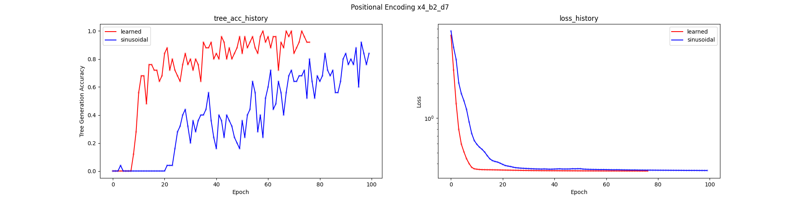
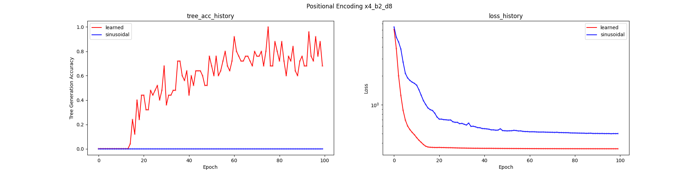
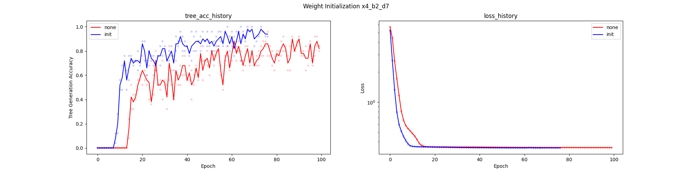
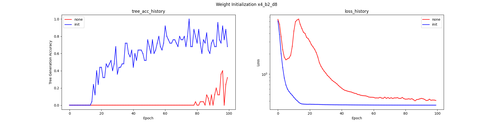

# Transformer Tree Generation

Some Transformer Experimentation generating a tree structure.

## Different tasks

We train model on permutations of a single tree and its ability to afterward predict a correct permutation of the tree.
First we analyse how the model performs on different tasks using a tree with branch factor 5 (b=5) and an increasing depth:

* fix: no permutations in the values [0, 1, ...]
* lwr: leaves values are sampled (among all siblings) with replacement
* nwr: all node values are sampled (among all siblings) with replacement
* lwor: leaves values are sampled (among all siblings) without replacement (tree permutation, only shuffling leaves)
* nwor: all node values are sampled (among all siblings) without replacement (tree permutation, shuffling leaves and branches)

The fix task can be solved by just memorizing the single tree.
The lwr task is just to learn the uniform distribution for each sibling over all fixed siblings (no conditions).
The nwr task is also parent-dependent, as the group of siblings depends on the sampled parent node.
The lwor task is not parent-dependent but previous-siblings-dependent, as the parent node is always fixed, but the previous siblings must be remembered.
The nwor task is parent-dependent and previous-siblings-dependent, as the parent node is sampled and the previous siblings must be remembered. 

| Task    | parent-dependent  | previous-siblings-dependent |  
|---------|-------------------|-----------------------------|
| nwr     | yes               | no                          |
| lwor    | no                | yes                         |
| nwor    | yes               | yes                         |

The experiments show that the parent-dependency seem to add no challenge whereas the previous-siblings-dependency seems to be challenging.
So predicting what is missing seems to be harder than learning a conditional rule about the parent node.
It is interesting that longer sequences seem to be harder to learn, even impossible for certain sequence lengths (not shown), regardless of the task being equally hard.
Additionally, "nwor" gets unstable for depth=3.

.png)

## Transformer Hyperparameter results

### Global Positional Encoding

Given a fixed tree structure the model has to learn to attend specific positions (parent nodes).
For that task learnable positional embeddings seems to help on easier tasks (b=2, d=7):

And is crucial for complex tasks (b=2, d=8):

### Weight Initialization

Instead of using the default PyTorch weight initialization, the model uses a common custom initialization for Transformers (see [init_weight](dec_model.py)):
* Embedding (encode, decode) with xavier_uniform 
* LayerNorm: weight=1, bias=0 
* Linear (hidden): weights=xavier_uniform, bias=0

This initialization seems to help on easier tasks (b=2, d=7):

And is crucial for complex tasks (b=2, d=8):

### Tie embeddings

Seems to make no big difference, [this](https://arxiv.org/pdf/1611.01462) suggests to do this, this suggestion do not do this:

